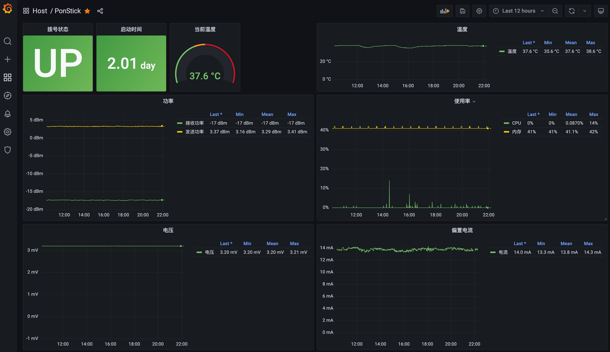

# Pon Stick Exporter

用于监控 ODI 猫棒状态



参考 [使用兮克-2.5g-交换机将北京联通-epon-改为-odi-猫棒接入](https://blog.hellowood.dev/posts/%E4%BD%BF%E7%94%A8%E5%85%AE%E5%85%8B-2.5g-%E4%BA%A4%E6%8D%A2%E6%9C%BA%E5%B0%86%E5%8C%97%E4%BA%AC%E8%81%94%E9%80%9A-epon-%E6%94%B9%E4%B8%BA-odi-%E7%8C%AB%E6%A3%92%E6%8E%A5%E5%85%A5/)

## 使用

1. 启动服务

```shell
docker compose up -d
```

2. 添加 Prometheus 任务

```
- job_name: pon-stick-exporter
  honor_timestamps: true
  scrape_interval: 15s
  scrape_timeout: 10s
  metrics_path: /metrics
  scheme: http
  static_configs:
  - targets:
    - pon-stick-exporter:9001
```

3. 导入 Grafana 面板

导入 [./dist/panel.json](./dist/panel.json) 文件
